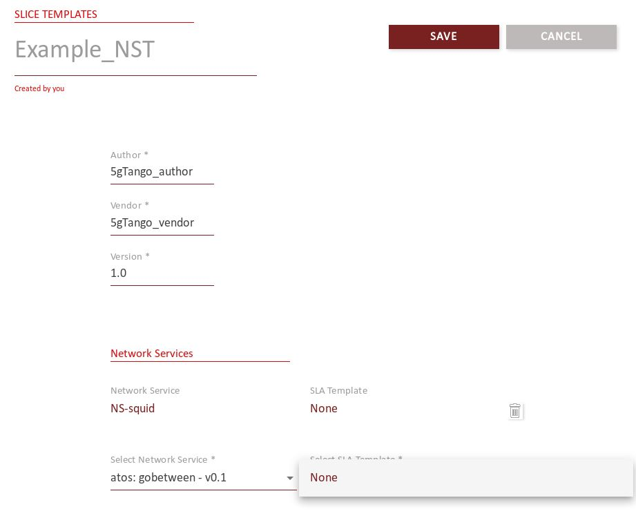
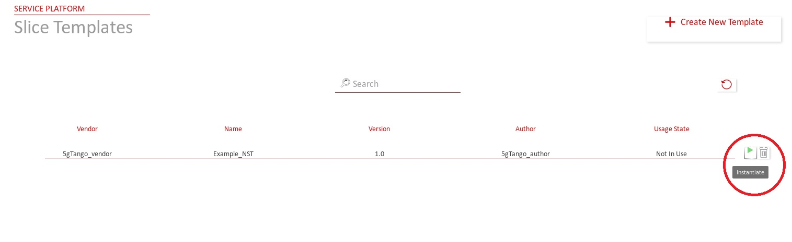
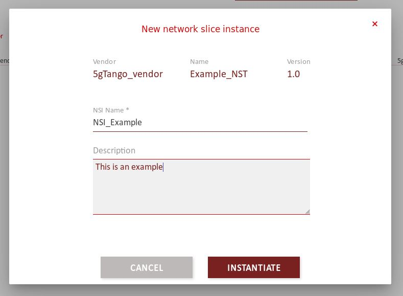
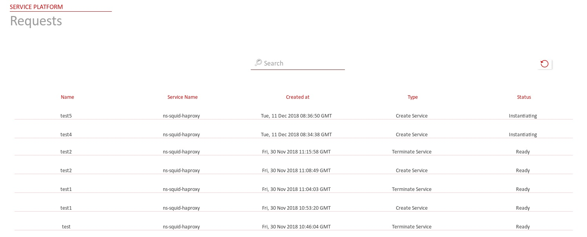

# Network Slicing

The current version of Sonata allows you to create a basi Network Slice by selecting the services you want to deploy and which SLA associated to each selected service. Before working with this feature, please make sure to read the guide about how to upload a package to the SP, Prerequisits section step 2 (`https://sonata-nfv.github.io/sp#prerequisites`).

If you already uploaded a service to the SP, it probably means that you already tried to instantiate it by itself following these instructions (`https://sonata-nfv.github.io/sp#instantiating-and-terminating-a-network-service`).

## Instantiating and terminating a Network Slice

- **Step 1:** Open the 5GTANGO portal in `http://<service_platform_ip>/` and go to `Service Platform -> Slices -> Templates`. In this screen you can see the list of available network slice templates. You can create one by pushin the "Create New Template" button on the upper left side of the screen.

- **Step 2:** Fill up the fields on the new screen and select all the services and their corresponding SLAs (if needed). once done click on "Save" button.

- **Step 3:** Now we are back to the "Templates" page and you should see your template within the list as the following image shows. Thenwe are ready to create a Network Slice Instance (NSI), just click on the "green play" symbol.

- **Step 4:** Write a name for your NSI and a description. To instantiate the NSI just click on "Instantiate" button and the slice will start to be instantiated. Please wait some time, the current Netowrk Slice Feature doesn't show automatically the record of the NSI until all the services are ready and the VIM answers back. (This will be solve to work as the services feature in a future release).
  

- **Step 5:** After some time, the instance should appear in the `Service Platform -> Slices -> Instances` section. If you go to the `Service Platform -> Slices -> Requests` section, you can see the historical requests, and the one regarding your last network slice instantiation should appear.
  

- **Step 6:** To terminate an instantiation, simply click on the "red stop" symbol next to the instance element and the process should start.

