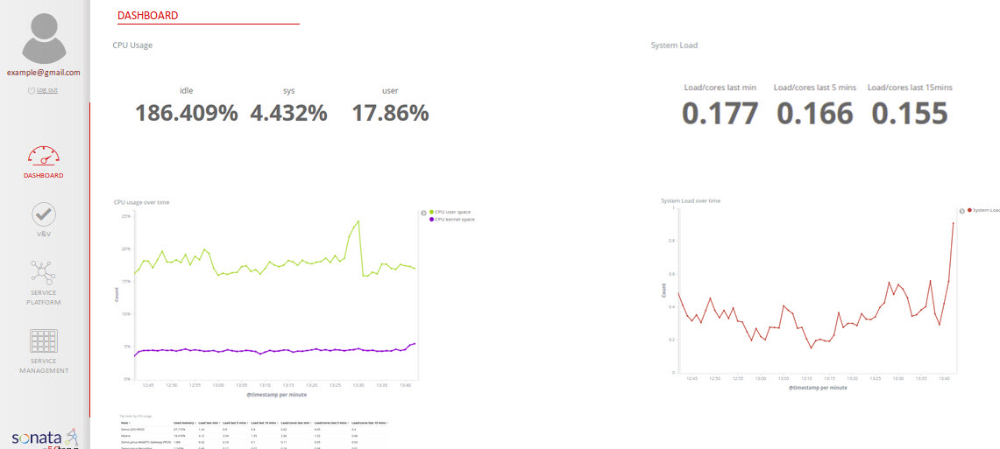
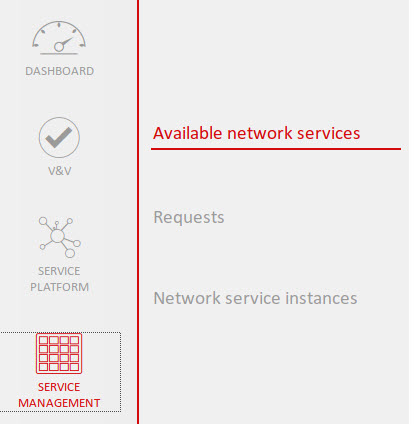
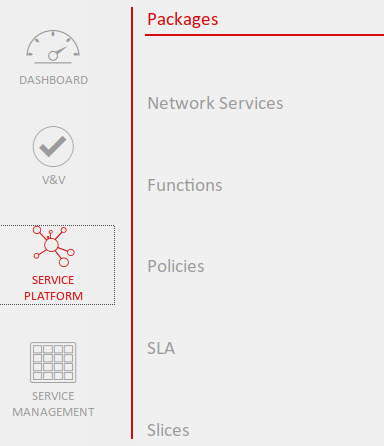

# VNF Images available in Openstack

Before starting deploying, it is recommended that the VNF Images are available in Openstack. If not, during the deploy time, sonata will download from the url link provided in the descriptor.

If a valid image is not avaible in the Vim or for downloading, it will give you an error.

# Configure VIM/WIM in Service Platform -> bash script

After the installation of the SP, you need to add a VIM to the it, you can use a simple bash script like this one. Just replace the variables at the beginning (marked in yellow) with the correct values for your VIM.

You can use the bash script located [here (`script`)]:(https://raw.githubusercontent.com/sonata-nfv/sonata-nfv.github.io/master/vim_script.sh)

Before executing it, you only need to open it and replace the values of your OpenStack environment.

# Service deployment

### Login to 5GTANGO Service Platform

Write the url (ip) of your service platform in any browser and you will be redirected to GUI's main dashboard:

In the SP you can configure the Services, the Functions and the Network Slices

Here is where you can work with your Network Services. You can deploy, check the status and terminate them:

### Instantiating and terminating a Network Service 

-   Step 1: Login and verify that the selected section is “Available Network Services” inside the Service Management. Here you can see the green play button. After pressing it the instantiation process will begin.

-   Step 2: In the section is “Network Services Instances” inside the Service Management. Here you can see the red stop button. After pressing it the terminate process will begin.

# Service Check

In the Dashboard, in the Network Service tab, you can check the status of the instantiated services.

