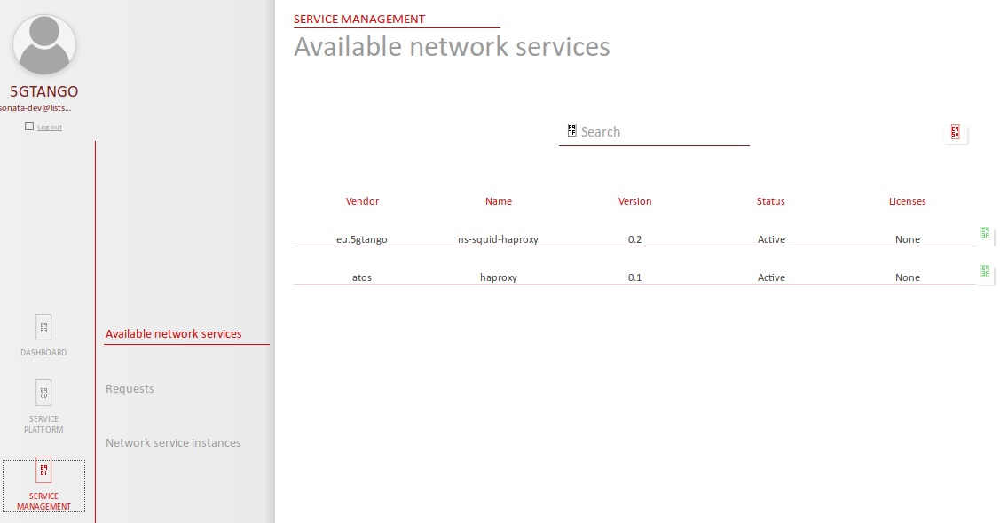
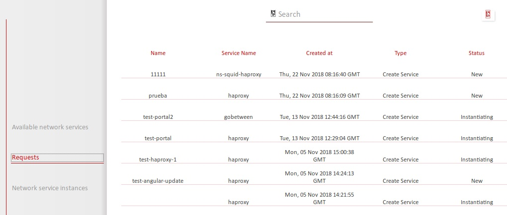
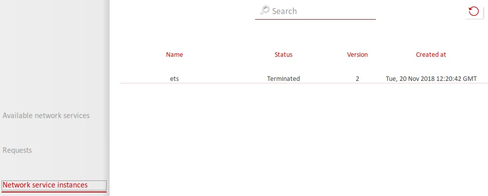

# Service Platform

With the installation of the Service Platform ready and the Descriptors already created is time to deploy our network service. To this end, you will need to fulfill a set of prerequisited described below.

## Prerequisites

1. VNF images available in Openstack:
   
   Check that the CIRROS image is available in openstack, if not you can download from here: [http://download.cirros-cloud.net/0.3.4/cirros-0.3.4-x86_64-disk.img](http://download.cirros-cloud.net/0.3.4/cirros-0.3.4-x86_64-disk.img)

2. VIM configured in the Service Platform:

   After the installation of the SP, you need to attach a VIM. You need to login in the Service Platform and select Settings/VIM, as shown in the following figure.
<p align="center"></p>

To get the tenant router uuid you can go to openstack horizon dashboard and open the route: `project -> network -> routers -> (select your router) -> Overview -> ID`

<p align="center"></p>

To get the external network uuid you can go to openstack horizon dashboard and open the route: `project -> network -> network -> (select your external net) -> Overview -> ID`

<p align="center"></p>

3. Check if the user have primary project assigned.

<p align="center"></p>

If not assign one at the end of the list in the menu.

<p align="center"></p>

4. Network service descriptor on-boarded to the Service Platform:

   The package used in this guide is availabe in [here](files/eu.5gtango.ns-squid-haproxy.0.1.tgo)   
  You need to download and install [tng-cli](https://github.com/sonata-nfv/tng-cli/).
 
 To install manually, with permissions:

```
git clone https://github.com/sonata-nfv/tng-cli.git
cd tng-cli
python3 setup.py install
``` 
  Configure SP through the `SP_PATH` env parameter:

```
export SP_PATH=<URL_TO_SP>
```
  
  Upload the package
```
tng-cli package -u eu.5gtango.ns-squid-haproxy.0.1.tgo
```

## Instantiating and terminating a Network Service

- **Step 1:** Open the 5GTANGO portal in `http://<service_platform_ip>/` and go to `Service Management -> Available network services`. In this screen you can see the list of available network services and you could instantate it pushing the green play button.

<p align="center"></p>

- **Step 2:** Select the service you desire to instantiate and press the green play button. Next, you will get a window that you can skip for now about ingress and egress networks. You can clic on Next button.

<p align="center"></p>

- **Step 3:** Write a name for your network service and don't select any SLA for now, the SLA part will be covered in the further guides. To instantiate the NS just click on INSTANTIATE button and the service will be instantiated inmediately.
  
<p align="center"></p>

## Service Check

In the Dashboard, in the Service Management tab, you can check the status of the instantiated services.

Here you can see and select a service to instantiate it:

<p align="center"></p>


Once launched, you can see the status of the instantiation operation in the requests tab:

<p align="center"></p>

Finally, you can see you instances:

<p align="center"></p>
