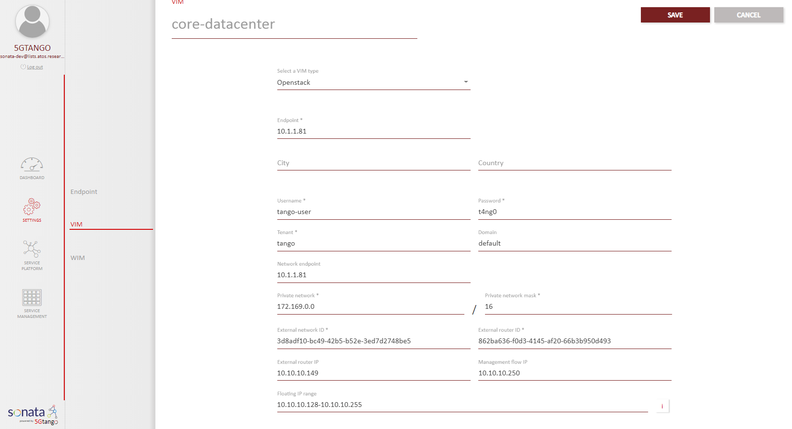
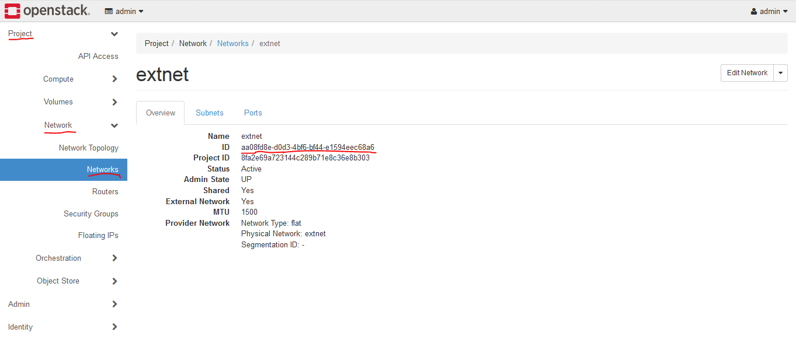
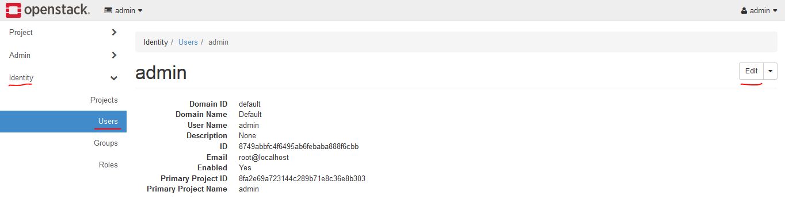
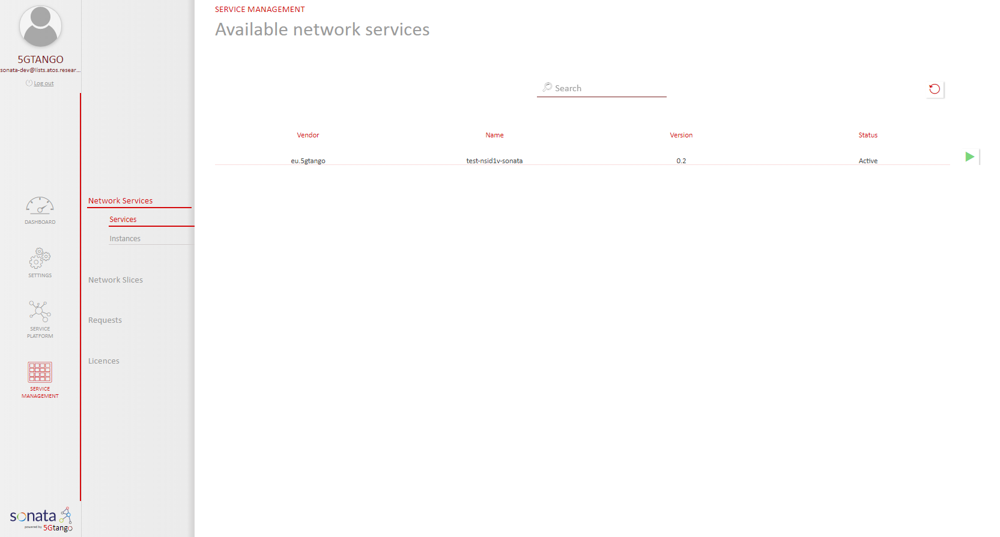
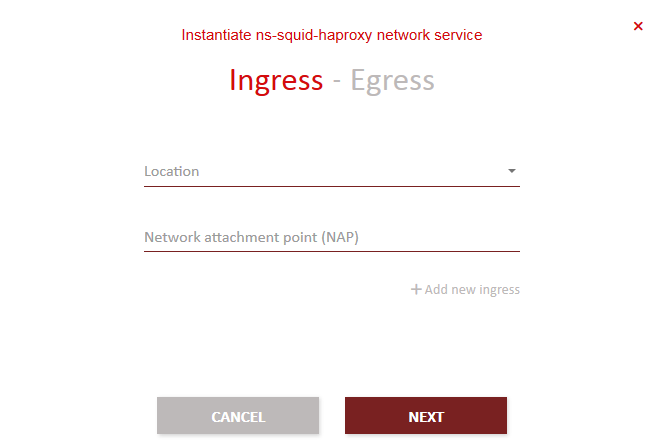
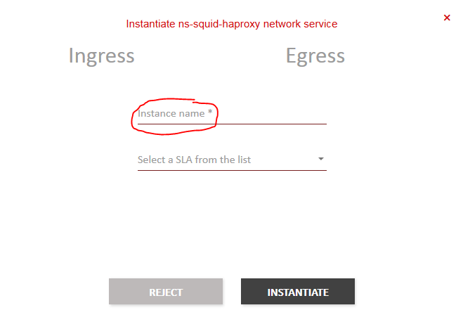
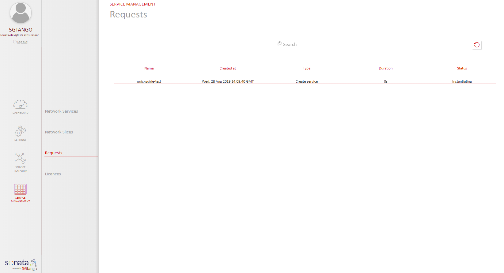
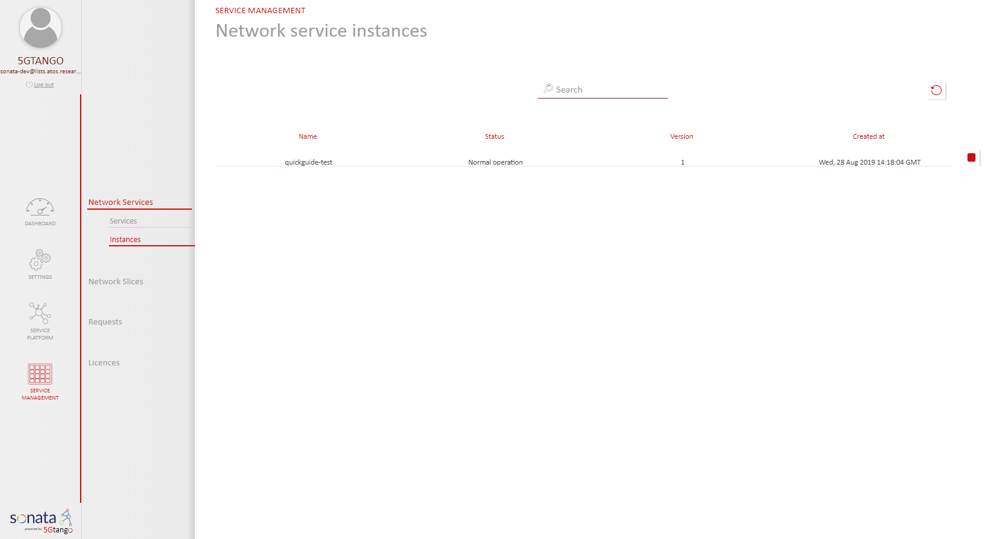

# Service Platform

With the installation of the Service Platform ready and the Descriptors already created is time to deploy our network service. To this end, you will need to fulfill a set of prerequisited described below.

## Prerequisites

1. VNF images available in Openstack:
   
   Check that the CIRROS image is available in openstack, if not you can download from here: [http://download.cirros-cloud.net/0.3.4/cirros-0.3.4-x86_64-disk.img](http://download.cirros-cloud.net/0.3.4/cirros-0.3.4-x86_64-disk.img)

 - Deploy monitoring probes

	In order to gather monitoring metrics from the running VNFs it is necessary to deploy the appropriate monitoring probes for each VIM and then to configure the SP to collect data from the above probes. Currently, the Service Platform Monitoring framework is able to collect monitoring metrics from three sources Kubernetes, Openstack Ceilometer and directly from libvirt. 
	
	a. Deploy monitoring pods inside a Kubernetes cluster
	- Deployment

	```
	git clone https://github.com/sonata-nfv/tng-monitor-infra.git
	cd K8s_mon
	kubectl apply -f /home/tango/k8s-monitoring.yaml
	```

	- Check status of the monitoring  pods

	```
	kubectl get services -n sonata
	NAME                                          READY   STATUS    RESTARTS   AGE
	grafana-core-7b84f8fb56-x9rhh                 1/1     Running   0          12s
	son-alertmanager-deployment-98c6c4548-6bfhm   1/1     Running   0          12s
	son-prometheus-deployment-8558fc9444-bmfl9    1/1     Running   0          12s
	son-pushgateway-deployment-794cd78755-qx7nl   1/1     Running   0          12s
	``` 

    - Configure SP to collect monitoring data from Kubernetes cluster by posting the appropiate configuration to the following REST api `https://pre-int-sp-ath.5gtango.eu/api/v3/monitoring/data/prometheus/targets`. For a Kubenetes cluster in ip `1.2.3.4` the configuration must be the following: 

    ```
    {"targets": [{
      "honor_labels": true,
      "job_name": "K8s_cluster_athens",
      "metrics_path": "/federate",
      "params": {
        "match[]": [
          "{job=\"kubernetes-cadvisor\"}",
          "{job=\"kubernetes-nodes\"}",
          "{job=\"kubernetes-pods\"}",
          "{job=\"pushgateway\"}"]},
      "scrape_interval": "10s",
      "scrape_timeout": "10s",
      "static_configs": [{"targets": ["1.2.3.4:30090"]}]},
    {"job_name": "pushgateway",
      "static_configs": [{
          "targets": ["pushgateway:9091"]}]
    },
    {"job_name": "prometheus",
      "static_configs": [{"targets": ["localhost:9090"]}]}
    ]}
    ``` 

	b. Deploy monitoring probe for collecting metrics directly from vibvirt
	In each compute node: 
	 - Deployment  

	```
	git clone https://github.com/sonata-nfv/tng-monitor-infra.git
	cd libvirtExporter
    docker build -t son-monitor-libvirtexp .
	docker run --privileged -d -p 9093:9091 -v /var/run/libvirt/libvirt-sock:/var/run/libvirt/libvirt-sock --name son-monitor-virtExporter son-monitor-libvirtexp
	```

	- Configure SP to collect monitoring data from the libvirt exporter by posting the appropiate configuration to the following REST api `https://pre-int-sp-ath.5gtango.eu/api/v3/monitoring/data/prometheus/targets`. For a libvirt exporter running in ip `1.2.3.4` the configuration must be the following: 

    ```
    {"targets": [{
      "job_name": "pushgateway",
      "static_configs": [{
          "targets": ["pushgateway:9091"]}]},
    {"job_name": "prometheus",
      "static_configs": [{
          "targets": ["localhost:9090"]}]},
    {"job_name": "VIM_1",
      "static_configs": [{
          "targets": ["1.2.3.4:9093"]}]}
    ]}
    ```

	c. Deploy monitoring probe for collecting metrics from Ceilomerer (Openstack)
	In controller node: 
	 - Deployment

	```
	git clone https://github.com/sonata-nfv/tng-monitor-infra.git
	cd mtrExporter
	docker build -t son-monitor-ceilexp
	docker run -d --name son-monitor-ceilExporter -p 10000:10000/udp -p 9092:9091 son-monitor-ceilexp
	```

	 - Ceilometer  configuration
	 Monitoring data from Openstack is transmitted to metric exporter using the pipeline feature of the ceilometer. In order to enable the pipeline service and define the udp socket you must make the following configuration in ceilometer side.
	  Set data collecting time interval and the metrics open the `polling.yaml`
	  

	```
	sources:
	    - name: some_pollsters
	      interval: 10
	      meters:
	        - cpu
	        - memory.usage
	        - network.incoming.bytes
	        - network.incoming.packets
	        - network.outgoing.bytes
	        - network.outgoing.packets
	        - disk.read.bytes
	        - disk.read.requests
	        - disk.write.bytes
	        - disk.write.requests
	        - hardware.cpu.util
	        - hardware.memory.used
	        - hardware.memory.total
	        - hardware.memory.buffer
	        - hardware.memory.cached
	        - hardware.memory.swap.avail
	        - hardware.memory.swap.total
	        - hardware.system_stats.io.outgoing.blocks
	        - hardware.system_stats.io.incoming.blocks
	        - hardware.network.ip.incoming.datagrams
	        - hardware.network.ip.outgoing.datagrams
	```

	Add the udp publisher in `pipeline.yaml`


	```
	...
      publishers:
         ...
          - udp://10.102.2.240:10000/
    ...
	```

    Enable the pipeline feature by adding the following lines in `ceilometer.conf`

	```
	[DEFAULT]
	pipeline_cfg_file = pipeline.yaml
	[polling]
	cfg_file = polling.yaml
	```

    Restart openstack ceilometer services

    ```
	service ceilometer-agent-central restart 
	service ceilometer-agent-notification restart 
	service ceilometer-api restart
	service ceilometer-agent-compute
	service ceilometer-collector restart
    ```

     - Configure SP to collect monitoring data from the metric exporter by posting the appropiate configuration to the following REST api `https://pre-int-sp-ath.5gtango.eu/api/v3/monitoring/data/prometheus/targets`. For a libvirt exporter running in ip `1.2.3.4` the configuration must be the following: 


    ```
    {"targets": [{
      "job_name": "pushgateway",
      "static_configs": [{
          "targets": ["pushgateway:9091"]}]},
    {"job_name": "prometheus",
      "static_configs": [{
          "targets": ["localhost:9090"]}]},
    {"job_name": "VIM_1",
      "static_configs": [{
          "targets": ["1.2.3.4:9091"]}]}
    ]}
    ```

2. VIM configured in the Service Platform:

   After the installation of the SP, you need to attach a VIM. You need to login in the Service Platform and select Settings/VIM, as shown in the following figure.
<p align="center"></p>

To get the tenant router uuid you can go to openstack horizon dashboard and open the route: `project -> network -> routers -> (select your router) -> Overview -> ID`

<p align="center"></p>

To get the external network uuid you can go to openstack horizon dashboard and open the route: `project -> network -> network -> (select your external net) -> Overview -> ID`

<p align="center"></p>

3. Check if the user have primary project assigned.

<p align="center"></p>

If not assign one at the end of the list in the menu.

<p align="center"></p>

4. Network service descriptor on-boarded to the Service Platform:

   The package used in this guide is availabe in [here](files/eu.5gtango.test-ns-nsid1v-sonata.0.2.tgo)   
  You need to download and install [tng-cli](https://github.com/sonata-nfv/tng-cli/).
 
 To install manually, with permissions:

```
git clone https://github.com/sonata-nfv/tng-cli.git
cd tng-cli
python3 setup.py install
``` 
  Configure SP through the `SP_PATH` env parameter:

```
export SP_PATH=<URL_TO_SP>
```
  
  Upload the package
```
tng-cli package -u eu.5gtango.test-ns-nsid1v-sonata.0.2.tgo
```

## Instantiating and terminating a Network Service

- **Step 1:** Open the 5GTANGO portal in `http://<service_platform_ip>/` and go to `Service Management -> Network Services -> Services`. In this screen you can see the list of available network services and you could instantate it pushing the green play button.

<p align="center"></p>

- **Step 2:** Select the service you desire to instantiate and press the green play button. Next, you will get a window that you can skip for now about ingress and egress networks. You can clic on Next button.

<p align="center"></p>

- **Step 3:** Write a name for your network service and don't select any SLA for now, the SLA part will be covered in the further guides. To instantiate the NS just click on INSTANTIATE button and the service will be instantiated inmediately.
  
<p align="center"></p>

## Service Check

In the Dashboard, in the Service Management tab, you can check the status of the instantiated services.

Once launched, you can see the status of the instantiation operation in the requests tab:

<p align="center"></p>

Finally, you can see you instances:

<p align="center"></p>
