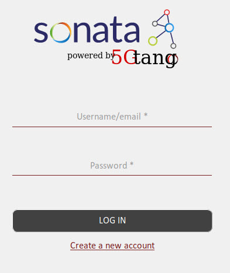
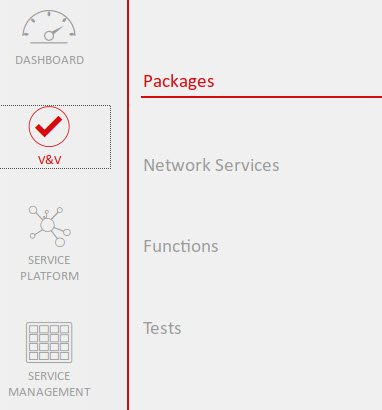
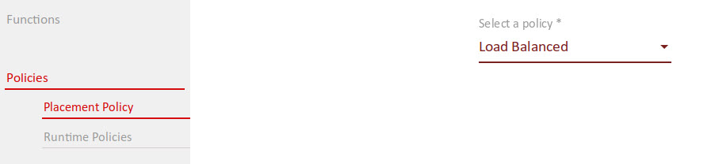
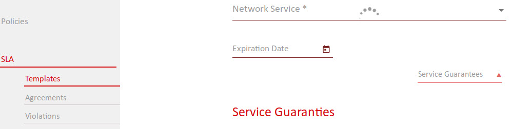

# Start using SONATA

## General workflow

Using the SONATA System is quite straight forward, you only need to follow the main steps shown in the general workflow figure bellow and explained in detail the following sections. 

 - Process workflow figure: [How_to_use_sonata.pptx](figures/How_to_use_sonata.pptx)
 

## Creating a network service with the SDK

The recommended workflow when developing a SONATA network service consists on using the CLI tools to create a workspace, create a project to hold the descriptors of the service, validate the components and finally, create a bundled service package. The required steps are as follows:

-   Step 1: Create Workspace

```
tng-workspace
````
tng-workspace --workspace path/to/workspace
````

-   Step 2: Create Project

```
tng-project -p path/to/project                # creates a new project at the specified path
tng-project -p path/to/project --add file1    # adds file1 to the project.yml
tng-project -p path/to/project --add file1 --type text/plain  # adds file1 with explicit MIME type
tng-project -p path/to/project --remove file1 # removes file1 from the project.yml
tng-project -p path/to/project --status       # shows project overview/status
```

NOTE: Since the structure of projects and descriptors changed from SONATA (v3.1) to 5GTANGO (v4.0), tng-project also provides a command to automatically translate old to new projects. For more information see the corresponding wiki page.
````
tng-project -p path/to/old-project --translate   # translates the project to the new structure
````


After this step, a sample Network Service Descriptor (NSD) and several Virtual Network Function Descriptors (VNFDs) are available at `<project_dir/sources>` directory.

-   Step 3: Validate and create the packages .tgo

The tng-sdk-package will create the .tgo package file after validating the structure of the descriptors.

```
tng-pkg -p misc/5gtango_ns_project_example1		# package a 5GTANGO SDK project
```
tng-pkg -u misc/5gtango-ns-package-example.tgo		# unpack a 5GTANGO package to a local 5GTANGO SDK project
```


After this step, if everything is correct, a package file named `5gtango_ns_project_example1.tgo` will be created.


-   Step 4: Onboard the package into the 5GTANGO Service Platform or Emulator


These are the most basic steps to develop a network service, however additional features may be used and configuration procedures may take place, when required. For instance, to compose a NSDs and VNFDs, the son-editor GUI may be used. Likewise, the son-validator GUI can also be used to trigger validations and visualize the resulting errors, the service network topology, the forwarding graphs, etc. Regarding configuration procedures, before step 6 takes place (onboard a network service to the service platform) the service platform URL and user credentials must be configured in the workspace. To learn more about the additional features and configuration requirements please consult the wiki \[documentation\](https://github.com/sonata-nfv/son-cli/wiki) of son-cli repository.


## Creating a Function Service Manager

To develop a new FSM or SSM the following steps needs to be taken:

1. Download the FSM/SSM template from son-sm repository, [here]

-   Since the son-sm repository contains a submodule directory, you need to use the following command for cloning it: git clone --recursive \[repository URL\]

2. Configure the template. [Here] you can find some FSM examples and [here][1] some examples for SSM.

First thing to configure is the the name of the FSM/SSM. In order to provide meaningful names for FSMs/SSMs and also avoid FSMs/SSMs name collision in Service Platform, A naming pattern is defined in SM template that contains the following fields:

For SSMs, the name includes:

-   son, \[`specific_manger_type`\],\[ `service_name`\],\[ `specific_manager_name`\], \[ `id_number`\]
    -   Example: `sonssmservice1placement1`

Fro FSMs, the name includes:

-   son, \[ `specific_manger_type`\],\[ `service_name`\],\[`function_name`\],\[`specific_manager_name`\], \[`id_number`\]
    -   Example: `sonfsmservice1firewallplacement1`

In the following you can find a short description of the mentioned above fields:

| Fields                  | Description                                                                              | Required for | Provided by |
|-------------------------|------------------------------------------------------------------------------------------|--------------|-------------|
| `specific_manager_type` | the FSM/SSM type which could be either fsm or ssm.                                       | FSMs/SSMs    | Developer   |
| `service_name`          | the name of the service that the FSM/SSM belongs to                                      | FSMs/SSMs    | Developer   |
| `function_name`         | the name of the VNF that the fsm belongs to                                              | FSMs         | Developer   |
| `specific_manager_name` | the actual fsm/ssm name (e.g., placement, scaling)                                       | FSMs/SSMs    | Developer   |
| `id_number`             | an id number to differentiate FSMs/SSMs developed for the same purpose)                  | FSMs/SSMs    | Developer   |
| `version`               | version of the FSM/SSM                                                                   | FSMs/SSMs    | Developer   |
| `description`           | the FSM/SSM description                                                                  | FSMs/SSMs    | Developer   |
| `uuid`                  | the FSM/SSM unique identifier                                                            | FSMs/SSMs    | SMR         |
| `sfuuid`                | the unique identifier of service/VNF that the FSM/SSM belongs to                         | FSMs/SSMs    | FLM/SLM     |
| `update_version`        | needs the be populated by`true` if the FSM/SSM is an updated version of existing FSM/SSM | FSMs/SSMs    | Developer   |

Once you are done with filling these fields you can start developing the actual function of your SSM/FSM by overwriting the on\_registration\_ok function of the template.

  [here]: https://github.com/sonata-nfv/son-sm/tree/master/son-sm-template
  [Here]: https://github.com/sonata-nfv/son-sm/tree/master/son-fsm-examples
  [1]: https://github.com/sonata-nfv/son-sm/tree/master/son-ssm-examples


3. Put your SSM/FSM in a docker container and push it to your own docker hub. [Here] you can create your own docker hub account to push your FSMs/SSMs there.

4. Put the SSM's id and URL in the NSD and the FSM's id and URL in the VNFD

-   A very important point here is that the SSM/FSM id that is going to be embedded in the descriptors should be the same as the id generated by the SSM/FSM template because this id will be used by SMR to instantiation, update and terminate the FSMs/FSMs. The following shows an example of an FSM id and URL embedded in the VNFD; you can find more examples [here].

```yaml

function_specific_managers:
  - id: "sonfsmservice1firewallplacement1"
    description: "placement FSM for firrewall"
    image: "hadik3r/sonfsmservice1firewallplacement1"

  - id: "sonfsmservice1firewallscaling1"
    description: "scaling FSM for firrewall"
    image: "hadik3r/sonfsmservice1firewallscaling1"
```

  [Here]: https://hub.docker.com/
  [here]: https://github.com/sonata-nfv/son-mano-framework/tree/master/son-mano-specificmanager/son-mano-specific-manager-registry/test/test_descriptors


## Upload VNF to glance

This step can be useful in order not to wait until Infrastructure abstraction downloads the image from the external link. You can upload it to glance before instantiating the NS. The instantiation will be really fast.

You can upload the image following this link [Openstack Manage images]

Notice that the VNF image name has to be composed by: <vnf_vendor>\_<vnf_name>\_<vnf_version>\_<virtual_deployment_units_id> You can find this information in the nsd, specifically in the network\_functions section:

```
 - vnf_id: "vtc_vnf"
   vnf_vendor: "eu.sonata-nfv"
   vnf_name: "vtc-vnf"
   vnf_version: "0.1"
```

And in the vnfd in the virtual\_deployment\_units section:

```
 - id: "1"
```

The final name in glance will be:

-   eu.sonata-nfv\_vtc-vnf\_0.1\_1

The VNF is accessible here: [VTC VNF]

  [Openstack Manage images]: https://docs.openstack.org/horizon/latest/user/manage-images.html
  [VTC VNF]: http://files.sonata-nfv.eu/public/eu.sonata-nfv_vtc-vnf_0.1_1.qcow2


## Testing a network service with the EMULATOR

To deploy and test a network service on the emulation platform you can use the son-cli tools just like you would do when pushing a service to the service platform. You can find an example service package and a detailed description of the workflow [online]. The main steps are as follows:

-   Preparation: Clone the example to your machine:
    -   `svn export https://github.com/sonata-nfv/son-tutorials/trunk/upb-containernet-emulator-summerschool-demo demo`
-   Preparation: Initialize the workspace
    -   `son-workspace --init`
-   Step 1: Start the emulator
    -   `sudo python ~/demo/topologies/son-emu_example3.py`
-   Step 2: Create a SONATA service package using son-cli
    -   `son-package --project demo/sonata-demo-service -n sonata-demo-service`
-   Step 3: Deploy the created service package on the emulator
    -   `son-access push --upload sonata-demo-service.son`
-   Step 4: Instantiate the service
    -   `son-access push --deploy `<insert service uuid from last step here>
-   Step 5: Check the running SONATA service
    -   `son-emu-cli compute list`

The output will show you the running VNFs of the service and the emulated datacenters:

<!--
```
+--------------+-------------+--------------------------------+-------------------+-------------------------------------+
| Datacenter   | Container   | Image                          | Interface list    | Datacenter interfaces               |
+==============+=============+================================+===================+=====================================+
| dc2          | snort_vnf   | sonatanfv/sonata-snort-ids-vnf | mgmt,input,output | dc2.s1-eth2,dc2.s1-eth3,dc2.s1-eth4 |
+--------------+-------------+--------------------------------+-------------------+-------------------------------------+
| dc1          | client      | sonatanfv/sonata-iperf3-vnf    | client-eth0       | dc1.s1-eth2                         |
+--------------+-------------+--------------------------------+-------------------+-------------------------------------+
| dc1          | server      | sonatanfv/sonata-iperf3-vnf    | server-eth0       | dc1.s1-eth3                         |
+--------------+-------------+--------------------------------+-------------------+-------------------------------------+
```
-->


| Datacenter   | Container   | Image                          | Interface list    | Datacenter interfaces               |
|--------------|-------------|--------------------------------|-------------------|-------------------------------------|
| dc2          | snort_vnf   | sonatanfv/sonata-snort-ids-vnf | mgmt,input,output | dc2.s1-eth2,dc2.s1-eth3,dc2.s1-eth4 |
| dc1          | client      | sonatanfv/sonata-iperf3-vnf    | client-eth0       | dc1.s1-eth2                         |
| dc1          | server      | sonatanfv/sonata-iperf3-vnf    | server-eth0       | dc1.s1-eth3                         |


  [online]: https://github.com/sonata-nfv/son-tutorials/tree/master/upb-containernet-emulator-summerschool-demo
  
### Monitoring a network service with the son-monitor

To monitor a service running under `son-emulator`, `son-monitor` requires a Monitor Service Descriptor (`msd`). It describes which metrics to gather on the specified VNFs. A detailed explanation on building a `msd` can be found [here]. For this quick guide, the following `msd` can be used:

```yaml
service_name: "sonata-demo-service"
version: "0.1"
author: "SONATA"
description: "Monitor descriptor example for the quick use guide"
dashboard: "son-demo-service"
vnf_metrics:
  - metric_type: "cpu"
    description: "cpu load (%)"
    vnf_ids:
      - vnf: "snort_vnf" 
nsd_links:
  - metric_type: "packet_count"
    description: "packet_count of links"
    link_ids:
      - description: "example tx traffic"
        link_id: "link-12"
        source: "client:client-eth0"
        destination: "snort_vnf:input"
        direction: "tx"
      - description: "example rx traffic"
        link_id: "link-32"
        source: "snort_vnf:output"
        destination: "server:server-eth0"
        direction: "rx"
```

-   Step 1: after creating the topology, `son-monitor` is started with:

```
son-monitor init start
```

-   Step 2: the metrics are gathered by submitting the previous `msd` file:

```
son-monitor msd -f sonata_demo_service.yml start
```

-   Step 3: browse the `son-monitor` [dashboard]
-   Step 4 (optional): to stop the gathering of metrics:

```
son-monitor msd -f sonata_demo_service.yml stop
```

-   Step 5 (optional): to stop `son-monitor`:

```
son-monitor init stop
```

[The `son-monitor` wiki pages][here] contain more information on how to use this tool.

### Analysing a network service with the son-analyze

The metrics generated by a running service can be analysed using `son-analyze`. This tool will bring a service's metrics inside an environment where the developer can further analyse them.

-   Step 1: first `son-analyze` need to be bootstrapped:

```
son-analyze bootstrap
```

-   Step 2: to start a `son-analyze` environment:

```
son-analyze run
```

-   Step 3: start browsing the displaying link. The environment will keep running as long as the previous is keep alive


Further information can be found [in the `son-analyze` wiki pages].

  [here]: https://github.com/sonata-nfv/son-cli/wiki/SONATA-Monitor:-Monitor-service-descriptor
  [dashboard]: http://localhost:3000
  [in the `son-analyze` wiki pages]: https://github.com/sonata-nfv/son-analyze/wiki

  [online]: https://github.com/sonata-nfv/son-tutorials/tree/master/upb-containernet-emula


## Deploying a service with the SERVICE PLATFORM

### Login to 5GTANGO Service Platform

-   Step 1: Fill the login form with your username and password and press the “Login” button:

<p align="center"></p>

-   Step 2: After the authorization check you will be redirected to GUI's main dashboard:

<p align="center"></p>


### Package on boarding

Package on-boarding in 5GTANGO consists of a sequence of steps, performed before the package is stored in the platform's Catalogues. These steps guarantee that only valid packages are made available to the platform owner's customers. That sequence of steps are the following:

1.  **Authenticate the developer submitting the package:** the openness demanded for the 5G era of Service Platforms do not necessarily imply anonymity. Knowing who its users are support not only security but also some still unforeseen and arbitrarily complex business models between the different stakeholders;
2.  **Authorize the developer submitting the package:** with the expected network-based relationships between all the stakeholders, access and usage restrictions can naturally be needed, which demands a flexible but strong authorization set of mechanisms to be in place;
3.  **Validating the submitted package:** packages, services and functions have to follow a predefined schema, enabling fully automatic processes to be put in place to orchestrate the service dependent instantiation. Package signing, if present, can also be verified in this phase of the on-boarding process. Furthermore, semantic and logical verifications can be made, e.g., to alert to invalid specified flows of traffic;
4.  **Submission for storage:** valid packages have to be stored, both as the whole file and a set of meta-data that can later be used by the MANO Framework when a service instantiation, update or termination is requested, without having to open and extract that information from the whole package again.

With this last step concluded successfully, the service remains ready to be instantiated by any customer of the SP owner (see the following sub-section).

### VnV

<p align="center"></p> 

In the VnV you can see the Services, the Functions and the tests stored in the catalog.

### Service Platform 

<p align="center"></p>

In the SP you can configure the Services, the Functions and the Network Slices

Also here you can create and configure the policies and SLAs, as we can see in the images below:

<p align="center"></p>
<p align="center"></p>


### Service Management 

<p align="center"></p>

Here is where you can work with your Network Services. You can deploy, check the status and terminate them.


### Instantiating and terminating a Network Service 

-   Step 1: Login and verify that the selected section is “Available Network Services” inside the Service Management. Here you can see the green play button. After pressing it the instantiation process will begin.

<p align="center"></p>


-   Step 2: In the section is “Network Services Instances” inside the Service Management. Here you can see the red stop button. After pressing it the terminate process will begin.

<p align="center"></p>
