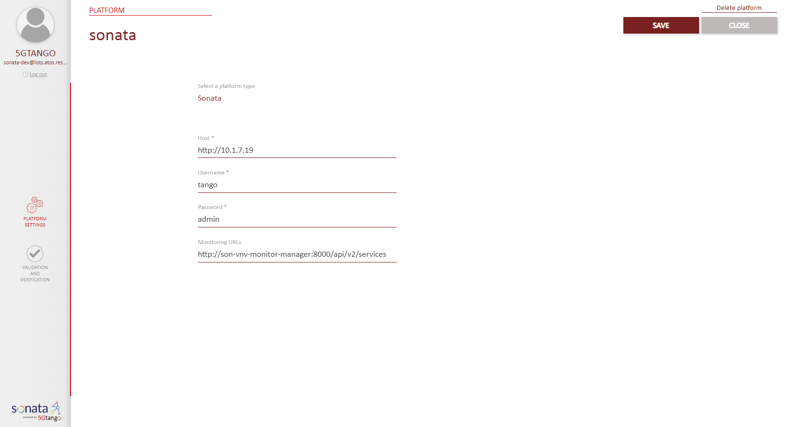
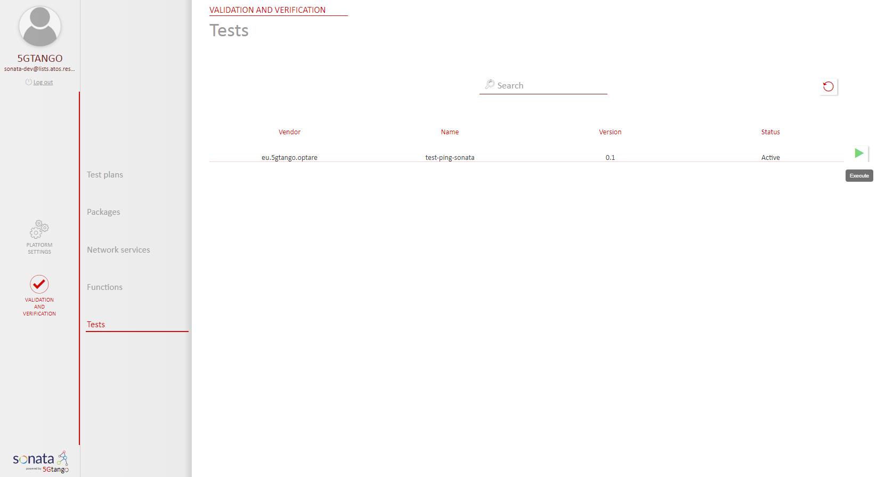
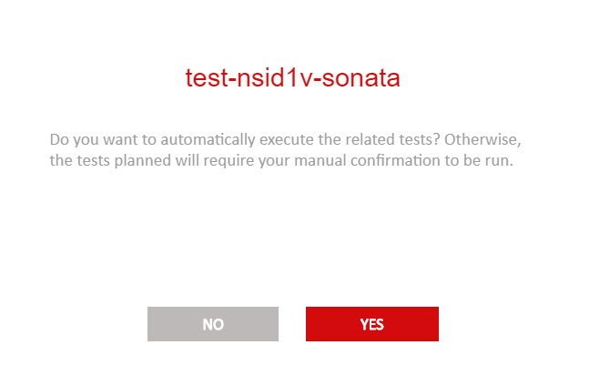
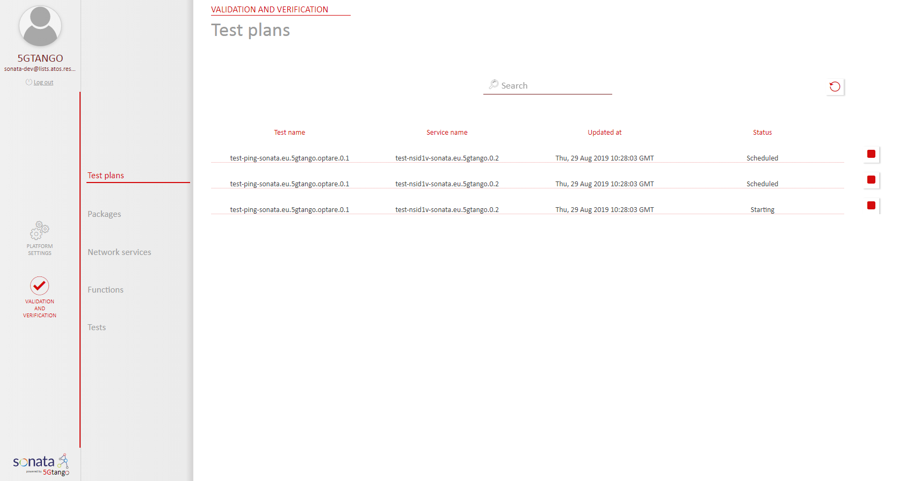
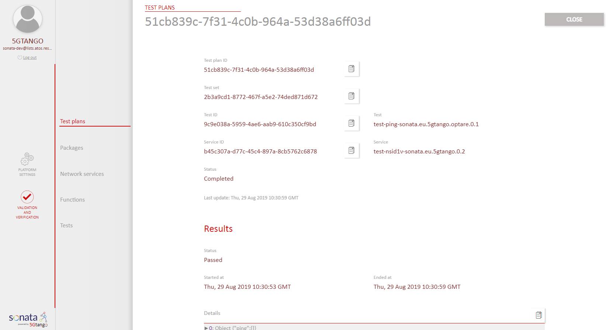

# Validation and Verification Platform

The V&V Platform is a mechanism of ensuring that the uploaded services can be tested on the appropriate target Service Platform to ensure that the service is considered fit for purpose. 

The outline of this quickguide for V&V is as follows:

1. [Link V&V to a Platform ](#link-vv-to-a-platform)
1. [Upload a Service Package and a Test Package](#upload-a-service-package-and-a-test-package)
1. [Creation and execution of a Test Plan(#creation-and-execution-of-a-test-plan)
1. [Checking Test Results](#checking-test-results)

## Link V&V to a Platform
For this quickguide we will use the proviously deployed SONATA Service Platform.

## Upload a Service Package and a Test Package

You will need to packages:

- Network Service package [eu.5gtango.test-ns-nsid1v-sonata.0.2.tgo](files/eu.5gtango.test-ns-nsid1v-sonata.0.2.tgo)
- Test package [eu.5gtango.generic-probes-test-pingonly-sonata.0.1.tgo](files/eu.5gtango.generic-probes-test-pingonly-sonata.0.1.tgo)

For installing them remember to point tng-cli to V&V platform, and type:
'''
tng-cli package -u eu.5gtango.test-ns-nsid1v-sonata.0.2.tgo
tng-cli package -u eu.5gtango.generic-probes-test-pingonly-sonata.0.1.tgo
'''

You can check if the packages have been successfully loaded into the V&V

## Creation and execution of a Test Plan

Note that the execution of the test is triggered if the tags in NSD and TD match and the testing tag is present in the package descriptor.   

You can accept test automatically run.

## Checking Test Results
Test start to run, and their status can be observed at V&V/Test plans.

Once test plan status is completed, all results can be observed.

